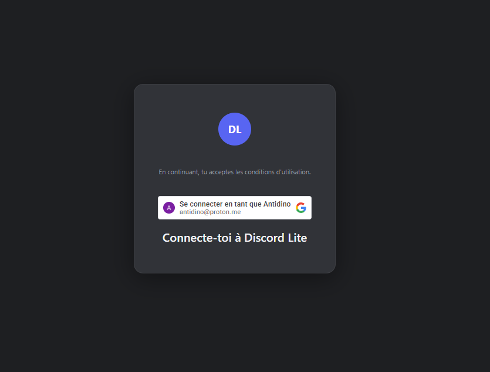
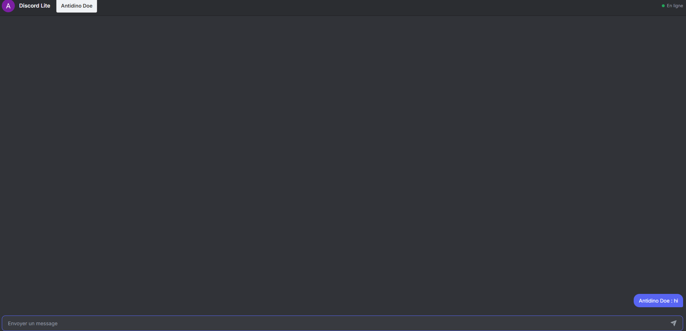

# Discord Lite

a discord-lite make for learn *node*

## Exemple




## Requirement

- [Node.js](https://nodejs.org/)
- npm

## Start

```javascript
npm install

npm start
```

## To do list

* [ ]  Historique des message
* [ ] Système de pseudo 
* [ ] ajout du markdown
* [ ] ajout des image et lien
* [ ] plus d'idée

## .env


SECRET_SESSION = {a password to create session systeme}

PORT  = {Your port}

## Status 
 Work in progress